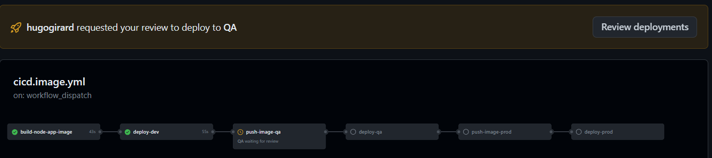

# Introduction

This GitHub repository show an example how you build a docker image and promote between different environments.

# Prerequisites

- Fork this GitHub repository
- Create Service Principal needed for [GitHub Actions](https://github.com/marketplace/actions/azure-login#configure-a-service-principal-with-a-secret).  Since all resource group are created in the Bicep file the Service Principal needs contributor access to the subscription.
- Create GitHub Secrets
- Create GitHub Environments

## GitHub Secrets

Here the list of secret you will need to create
| Secret Name | Description | Link |
| ----------- | ----------- | ----- |
| AZURE_CREDENTIALS | Service Principal credentials | [Link](https://github.com/marketplace/actions/azure-login#configure-a-service-principal-with-a-secret)
| AZURE_SUBSCRIPTION_ID | Azure Subscription ID |
| ADMIN_GROUP_ID | The group admin ID in Azure Active Directory for the Kubernetes Admin | [Link](https://learn.microsoft.com/en-us/azure/aks/azure-ad-rbac?tabs=portal)
| SERVICE_PRINCIPAL_ID | The client ID of the Service Principal, important be sure to use the **Enterprise Object ID** |
| PA_TOKEN | Personal Access Token ([PAT](https://github.com/marketplace/actions/create-github-secret-action#pa_token)) to access the GitHub repository |
| SP_CLIENT_ID | The client ID of the Service Principal used in the Azure_CREDENTIALS secrets |
| SP_PASSWD | The client secret of the Service Principal used in the Azure_CREDENTIALS secrets |

## Environments

Now you need to create three GitHub [environments](https://docs.github.com/en/actions/deployment/targeting-different-environments/using-environments-for-deployment)

What is important is to have a protection rule for QA and PROD environment.  This will prevent any deployment to these environments without a manual approval.

# Create the Azure Resources

Now you can run the GitHub workflow **Create Azure Resources**.

This will create 3 resources group that contains each one Azure Container Registry and an Azure Kubernetes Service.

Basically the 3 resources group will represent the 3 environment.

This is what the bicep template will create

# Build the Docker Image

Now you can build and deploy the docker image to the Azure Container Registry in Development.  Just run the GitHub workflow called **Deploy on Kubernetes**

One the image is built and deployed in DEV environment you will need to approve to be deployed in QA environment.

If you go in the Azure Portal, in the AKS for the Dev environment you will see the service called **svc-nodeapp-demo**

Click on the External IP hyperlink.

Here you see the environment and the version of the image deployed.  In this case we use the GitHub SHA that correspond to the commit number.

Now you can approve the deployment in QA environment.

This will just copy the docker image in dev with the version in QA.  The image won't be build again since we want to keep the same version number and no needs to rebuild the image.

Now, go to the QA AKS cluster and get the External IP of the service.

You can see that the version is the same as the DEV environment.

Now, repeat the same step than before for QA for the Production Environment.

Again, here in production the image was copied from QA to production without been rebuild so the version number is the same.